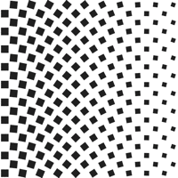

# Exploration of regular patterns written on Processing

nameOfSktech**Anim**.pde => an animated code    
nameOfSketch**Plot**.pde=> a code which generated .svg file designed to a penplotter like an axidraw

## sqrPttrnAnim

## sqrPttrnPlott
