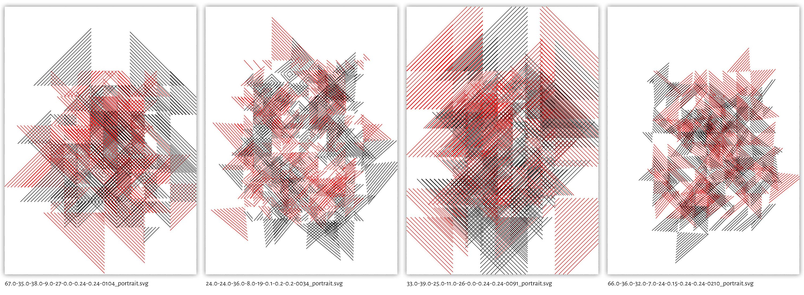
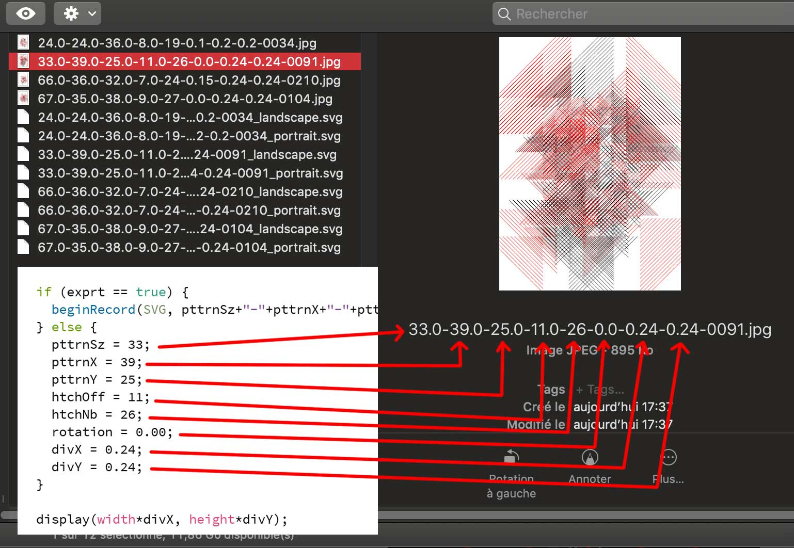

## hatchingPttrn_overflow  
A pattern generator simply based on hatching.
Hatches exceed the limit of the pattern's, that's why hatches overlapse each other.

   

You can tweak the pattern by playing with some variables.   
  
Exported files show you how to reproduce them:    
  

