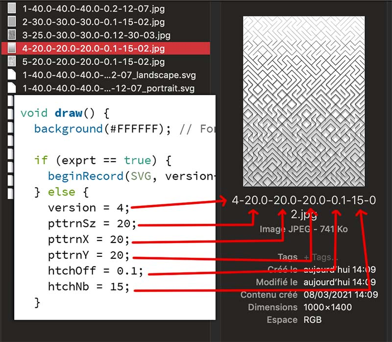

## hatchingPttrn_maze   

A pattern generator simply based on hatching. So it looks like a maze.   
Hatches are not regularly spaced: offset becomes larger according the number of hatches.   

You can tweak the pattern by playing with some variables.   
  
Exported files show you how to reproduce them:    
  

